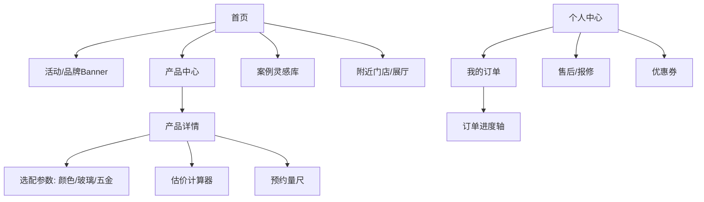
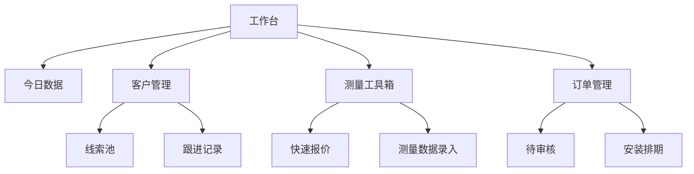

# 门窗业务 App 原型设计方案

## 1. 总体架构
建议采用 **“微信小程序矩阵”** 或 **“App多角色切换”** 模式。
*   **核心色调**：建议使用深蓝/深灰（高端、稳重）或 极简白（现代感），参考 `template_examples/商务.json` 中的风格。

---

## 2. C端：消费者营销版 (Sunhohi Home)
**核心目标**：种草、体验、留资、查进度。

### 2.1 功能架构图

### 2.2 关键页面原型描述

#### A. 首页 (Home)
*   **顶部**：沉浸式视频 Banner，展示隔音/防水测试，建立信任。
*   **金刚区**：断桥铝窗、系统门、阳光房、入户门、预约量尺。
*   **爆款推荐**：卡片式滑动展示热门系列（如：75系列静音窗）。

#### B. 智能估价器 (Quote Calculator)
*   **交互**：
    1. 选择窗型（推拉/平开/内倒）。
    2. 输入预估面积（长 x 高）。
    3. 勾选配置（三层中空/Low-E/进口五金）。
    4. **输出**：预估总价范围（注明：最终价格以实地测量为准）。
    5. **转化**：底部按钮“获取精准报价” -> 触发留资/预约量尺。

#### C. 订单全链路追踪 (Order Tracker)
*   **进度条状态**：
    1. [已预约] 等待师傅上门
    2. [测量中] 师傅已上传草图
    3. [设计中] 方案确认
    4. [生产中] 工厂切料/组装 (可展示车间实时监控截图)
    5. [发货中] 物流单号
    6. [安装中] 预约安装时间
    7. [已交付] 评价与质保激活

---

## 3. B端：经销商/导购工作台 (Sunhohi Work)
**核心目标**：高效开单、避免错单、客户管理。

### 3.1 功能架构图

### 3.2 关键页面原型描述

#### A. 数字化测量工具 (Digital Measure)
*   **痛点解决**：替代手写纸张，防止潦草出错。
*   **界面**：
    *   **位置标记**：客厅/主卧/阳台。
    *   **洞口拍照**：调用相机拍照并支持画笔标注。
    *   **数据录入**：宽、高、墙厚、中挺位置。
    *   **特殊项**：转角立柱、附框、颜色备注。
    *   **输出**：生成标准测量单PDF，一键分享给客户确认。

#### B. 报价生成器 (Quotation Maker)
*   **逻辑**：关联产品库价格。
*   **操作**：导入测量数据 -> 选择型材系列 -> 自动计算总面积与单价 -> 添加辅材费/安装费 -> 生成正式报价单。
*   **优势**：规范化报价，避免销售私自乱承诺。

#### C. 客户雷达 (CRM)
*   展示客户浏览C端小程序的轨迹（例如：客户看了“108系列”5次，立刻提醒销售跟进）。

---

## 4. 原型交付物清单 (建议)
1.  **低保真线框图 (Lo-Fi)**：确定布局和交互逻辑。
2.  **高保真UI图 (Hi-Fi)**：结合 VI 色调。
3.  **交互Demo**：使用 Axure 或 Figma 制作可点击版本。
