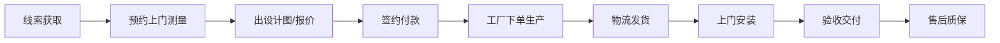

# 关键上下文 - 门窗业务 App & Web 原型

## 1. 核心业务逻辑 (Domain Logic)

### 1.1 用户角色
1.  **C端业主 (User)**: 浏览款式、预约测量、查看进度、报修。
2.  **B端经销商/销售 (Dealer/Sales)**: 客户管理(CRM)、现场测量录入、出报价单、合同管理。
3.  **安装师傅 (Installer)**: 接单、上门打卡、安装验收拍照。
4.  **总部/工厂 (Admin)**: 订单排产、发货管理、财务结算。

### 1.2 核心流程 (The Happy Path)

## 2. Web端 (官网) 功能架构
> **定位**: 营销门户，获取线索
- **首页**: 品牌视频、爆款推荐、免费预约入口。
- **产品中心**:
    - 门（入户门、推拉门、折叠门）
    - 窗（断桥铝、系统窗、阳光房）
    - 筛选：材质、风格、隔音/隔热等级。
- **解决方案**: 封阳台、老房换窗、别墅配套。
- **真实案例**: 按"楼盘"或"风格"展示。
- **自助估价**: 简易计算器（长 x 宽 x 单价）。

## 3. App端 (业务) 功能架构
> **定位**: 效率工具，服务交付
- **首页(Dashboard)**: 待办事项（待测量、待安装）、业绩看板。
- **项目管理**: 
    - 测量记录（上传手稿/CAD，录入洞口尺寸）。
    - 报价生成（选择型材系列，自动计算总价）。
- **CRM**: 客户跟进记录。
- **工具箱**: 水平仪、噪音测试、色卡对照。
- **我的**: 佣金、订单统计。

## 4. 关键变量/术语
- **断桥铝 (Thermal Break Aluminum)**: 核心卖点，隔热保温。
- **系统窗 (System Window)**: 高性能、一体化设计的窗户。
- **K值 (K-value)**: 传热系数，越低越好。
- **开启扇 (Opening Sash)**: 可开启的部分，通常按个收费或包含在套餐内。
- **辅料**: 发泡胶、密封胶、转角立柱（这些是隐形增项，需透明化）。
