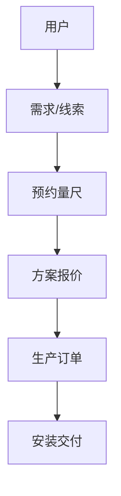

# 关键上下文 - 门窗业务App与Web原型设计

## 1. 核心决策记录
### 决策 #1: 采用 HTML/Tailwind 实现原型
- 时间: 2025-11-24
- 原因: 相比静态图片，HTML原型可交互、响应式，且代码可复用于后续开发。
- 影响: 需要编写前端代码，但交付物更具价值。

### 决策 #2: 聚焦 "高端定制" 风格
- 原因: 门窗行业趋势向高端、系统门窗发展，强调极简、窄边框设计。
- 影响: UI设计将采用大量留白、大图展示、黑白灰主色调。

## 2. 关键文件清单
### 新增的文件:
- `prototypes/web/index.html`: 官网首页
- `prototypes/web/product-detail.html`: 产品详情与选配
- `prototypes/app/home.html`: App首页
- `prototypes/app/measure.html`: 预约测量页

## 3. 业务实体模型 (简版)

## 4. 重要变量/常量
- **产品类型**: 铝合金窗、断桥铝、推拉门、平开门、阳光房。
- **定制参数**: 型材颜色（黑/灰/咖/金）、玻璃（中空/夹胶/Low-E）、五金（进口/国产）。

## 5. 待办事项
- [ ] 完善 Web 端产品选配交互逻辑。
- [ ] 增加 App 端的消息通知模拟。
