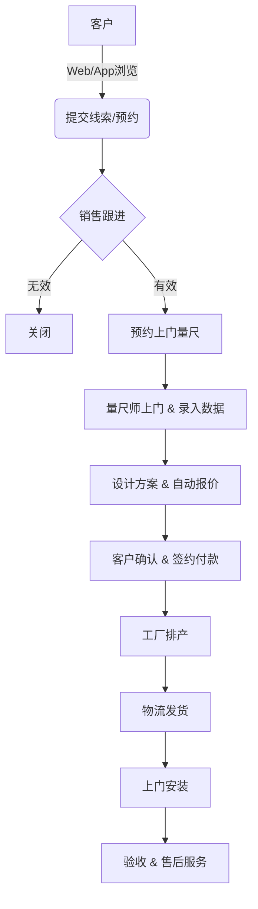

# 门窗业务调研与分析报告

## 1. 行业背景与特性
门窗行业属于定制化制造业，具有以下显著特征：
- **非标定制**：几乎每笔订单的尺寸、颜色、开启方式、玻璃配置都不同。
- **流程长**：线索 -> 预约量尺 -> 方案设计 -> 报价 -> 签约 -> 下单生产 -> 物流 -> 安装 -> 售后。
- **客单价高**：决策周期长，用户对品牌信任度要求高。
- **服务依赖重**："三分产品，七分安装"，安装质量直接影响口碑。

## 2. 核心痛点
1.  **报价难**：计算公式复杂（面积差价、五金配件、辅材），人工报价容易出错且效率低。
2.  **沟通误差**：手写测量数据字迹潦草，导致生产出错；效果图与实物不符。
3.  **进度不透明**：客户不知道窗户做好了没有，什么时候能装。
4.  **营销获客**：传统门店被动等客，缺乏线上引流和案例展示手段。

## 3. 数字化解决方案目标
我们需要构建一套 **"App + Web" 一体化平台**：

### A. 品牌官网 (Web端)
**定位**：品牌形象展示、流量入口、PC端管理后台。
**核心功能**：
- 品牌故事与实力展示（工厂VR、资质证书）。
- 产品数字化展厅（3D/图片/视频）。
- 真实案例库（按小区、户型搜索）。
- 在线预约/免费量尺入口。
- 招商加盟通道。

### B. 业务移动端 (App/小程序)
**定位**：销售工具、交付助手、客户服务中心。
**核心角色与功能**：
1.  **导购/销售 (Sales)**：
    - 案例展示（Pad端效果好）。
    - 快速报价（CPQ系统，输入尺寸自动算价）。
    - 客户CRM管理（跟进记录）。
2.  **设计师/量尺师 (Measurer)**：
    - 预约管理。
    - 现场量尺数据录入（拍照、标注）。
    - 生成简易方案图。
3.  **客户 (Customer)**：
    - 订单进度查询。
    - 安装预约。
    - 售后报修。

## 4. 业务流程图 (Mermaid)

## 5. 竞品分析参考
- **酷家乐/三维家**：侧重前端设计与渲染，但门窗专业算料略弱。
- **杜特/门窗港**：侧重工厂端ERP，前端体验较差。
- **理想状态**：前端极其简洁（像贝壳找房），后端逻辑强大（像ERP）。
