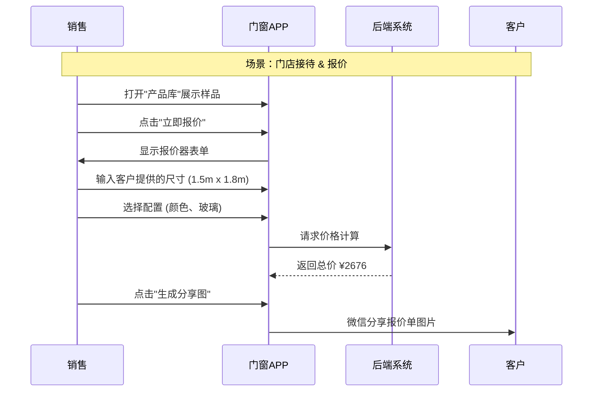

# App 原型设计方案 (Door & Window Sales & Service App)

## 1. 产品定位
**名称**：门窗管家 (Window Master)
**用户端**：销售/导购、量尺/设计师、安装师傅、普通客户（小程序端）。
**核心价值**：提高销售转化率，降低测量与生产误差，提升客户服务体验。

## 2. 功能架构 (Information Architecture)

### A. 首页 (Dashboard)
- **顶部**：搜索栏（搜客户/订单/产品）。
- **快捷功能区**：新建线索、快速报价、预约量尺、扫码查单。
- **数据概览 (销售/老板可见)**：本月业绩、待办事项数、转化率图表。
- **消息通知**：订单状态变更、预约提醒。

### B. 产品库 (Digital Showroom)
- **分类导航**：推拉窗、平开窗、阳光房、入户门。
- **产品详情**：
  - 轮播图/视频。
  - 3D 爆炸图（展示型材结构）。
  - 参数配置（颜色、玻璃、五金）。
  - **核心功能：一键报价**（跳转到报价器）。

### C. 报价工具 (CPQ - Smart Quoter)
*这是 App 最核心的功能*
- **输入尺寸**：宽 (mm) x 高 (mm)。
- **选配**：
  - 开启扇数量。
  - 玻璃升级（Low-E, 夹胶, 中空）。
  - 纱窗类型（金刚网, 高透）。
  - 辅料（转角料, 附框）。
- **输出**：实时计算总价，生成 PDF 报价单分享给微信。

### D. 客户与订单 (CRM + OMS)
- **客户列表**：跟进状态（线索/量尺/签约/完成）。
- **量尺记录**：上传手绘图、现场照片、CAD文件。
- **订单进度**：时间轴展示（下单 -> 生产 -> 出库 -> 安装）。

### E. 个人中心
- 账号设置、切换门店、我的业绩、帮助文档。

## 3. 关键页面线框描述 (Textual Wireframe)

### 3.1 报价器页面 (The Quoter)
```text
+-----------------------------------+
| < 返回      智能报价        保存 |
+-----------------------------------+
| 产品：维罗纳118断桥平开窗         |
| 基准价：¥880/m²                   |
+-----------------------------------+
| [ 尺寸输入 ]                      |
| 宽(mm): [ 1500 ]  高(mm): [ 1800 ]|
| 面积：2.7 m²                      |
+-----------------------------------+
| [ 开启扇配置 ]                    |
| 数量: [-] 1 [+]  (+ ¥300/扇)      |
+-----------------------------------+
| [ 玻璃升级 ]                      |
| (o) 标配 5+20A+5                  |
| ( ) 升级 Low-E (+ ¥60/m²)         |
+-----------------------------------+
| [ 颜色选择 ]                      |
| [砂灰] [氟碳金] [肌肤白]          |
+-----------------------------------+
| 预估总价：¥ 2,676.00              |
| --------------------------------- |
| [ 生成报价单 ]   [ 加入购物车 ]   |
+-----------------------------------+
```

### 3.2 订单进度页面 (Order Tracking)
```text
+-----------------------------------+
| < 返回       订单详情        客服 |
+-----------------------------------+
| 订单号：DH-20231124-001           |
| 客户：李先生 (碧桂园 3-2-1001)    |
+-----------------------------------+
| 当前状态：[ 🚚 运输中 ]           |
| 预计送达：2023-11-26              |
+-----------------------------------+
| 进度追踪：                        |
| |                                 |
| o 2023-11-24 09:00 物流已揽件     |
| |                                 |
| o 2023-11-22 14:00 工厂质检通过   |
| |                                 |
| o 2023-11-15 10:00 下单生产       |
| |                                 |
| o 2023-11-14 16:00 财务审核通过   |
+-----------------------------------+
| [ 查看安装预约 ]  [ 确认收货 ]    |
+-----------------------------------+
```

## 4. 交互流程 (User Flow)


