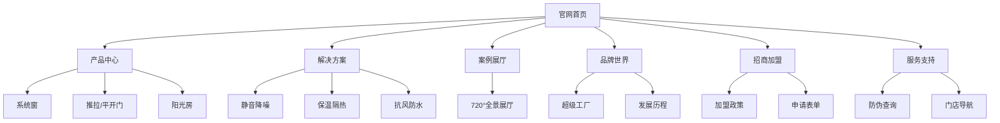

# 门窗业务 Web 官网原型设计方案

## 1. 设计定位
*   **风格**：宽屏响应式设计，强调空间感和通透感（呼应“窗”的属性）。
*   **受众**：C端业主（电脑端选款）、设计师（下载素材）、意向加盟商。

---

## 2. 站点地图 (Site Map)

---

## 3. 关键页面原型布局

### 3.1 首页 (Home Page)
*   **Hero Banner**: 全屏轮播图，展示“窗外风景”与“室内宁静”的对比，配文案“静享生活”。
*   **核心卖点区**: 3个图标块 —— 隔音45dB | 节能60% | 终身质保。
*   **明星产品**: 左右布局，左侧产品大图（支持鼠标悬停放大细节），右侧参数简介。
*   **品牌背书**: 滚动展示“德国红点奖”、“CNAS实验室认证”等Logo。
*   **浮动侧栏**: 预约量尺 / 电话咨询 / 在线客服。

### 3.2 产品详情页 (Product Detail)
*   **结构化参数表**: 
    | 参数 | 规格 |
    | :--- | :--- |
    | 型材壁厚 | 1.8mm / 2.0mm |
    | 玻璃配置 | 5+20A+5 钢化中空 |
    | 隔热条 | PA66GF25 (进口) |
    | 五金品牌 | 好博 / 希美克 |
*   **场景切换**: 提供“白天/黑夜”、“晴天/雨天”的场景渲染图切换。
*   **截面结构图**: 展示多道密封设计（这对专业买家很有说服力）。

### 3.3 招商加盟页 (Franchise - 重点)
*   **利润计算器**: 输入店铺面积、所在城市，预估投资回报周期。
*   **扶持政策**: 装修补贴、样角免费、广告报销可视化展示。
*   **优秀商展示**: 视频采访现有赚钱的经销商。
*   **加盟流程轴**: 咨询 -> 考察 -> 签约 -> 装修 -> 开业。

---

## 4. 技术建议
*   **SEO优化**: 每个产品页独立的 Title/Description，针对“断桥铝”、“系统窗”等关键词优化。
*   **加载速度**: 图片需使用 WebP 格式，因为门窗图片细节多、体积大。
*   **多端适配**: 保证在 iPad 和 手机浏览器 上也能完美展示（自适应布局）。
